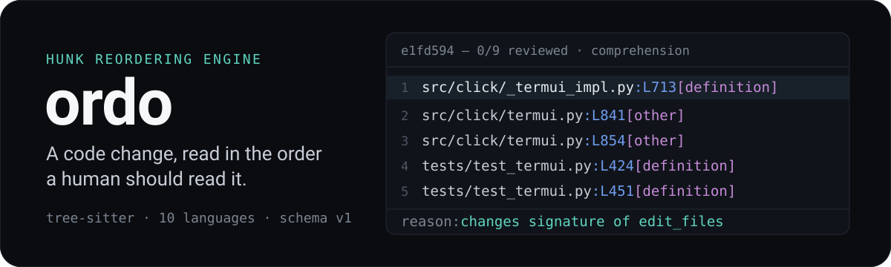
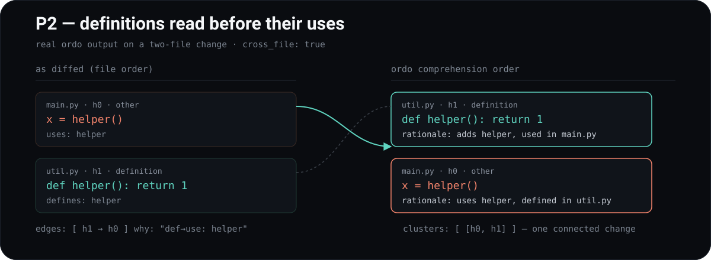

<p align="center">
  
</p>

<p align="center">
  <a href="https://github.com/FoamScience/ordo/actions/workflows/ci.yml"></a>
  
  
</p>

**Diffs arrive in file order. Nobody reads them that way.**

`ordo` is a standalone, language-agnostic engine that reorders the **hunks** of
a code change into a **comprehension-optimized** reading order, with per-hunk
semantic metadata and a human-readable rationale. One core, many consumers —
editors, CLIs, CI, review bots — all speaking one frozen JSON contract.

Grounded in Baum, Schneider & Bacchelli (ICSME 2017): **P1** keep related
changes together, **P2** definitions before their uses, **P3** grouping is the
dominant win. Ordering is a comprehension *aid*, not a correctness fix — treat
it as such.

## What you get

- **A reading order**, not a file listing — a deterministic permutation of the
  change's hunks, definitions ahead of their uses.
- **A rationale per hunk** — one plain sentence saying why it is where it is
  and what it did: `adds parse_cfg, used in main.py`, `changes signature of
  parse`, `renames foo → bar`, `removes 31 lines`.
- **A detail layer** — what the hunk did to its container's members: which enum
  variant, struct field, object property or call keyword actually moved.
- **Clusters** — the change's independent parts. One cluster means the change
  is atomic; several is a candidate PR split.
- **Advisories** — curated, deterministic guidance on advanced constructs
  (metaclasses, `unsafe`, raw `new`/`delete`, shell injection), with an
  escalation ladder and a verdict only when the pattern is concretely wrong.
- **Noise flags** — generated, lock and pure-formatting hunks marked so a
  client can dim or drop them.
- **Full accounting** — every hunk the diff produced is either in the reading
  order or recorded in `dropped` with the reason, so a consumer can prove
  nothing went missing silently.
- **Your own rules** — conventions as data (path/name facts plus tree-sitter
  queries) that annotate, flag, or move a hunk earlier in the reading order,
  without ever overriding definitions-before-uses.
- **Intra-line refinement** — when a removed and an added line are the same line
  edited, only the part that changed is highlighted, over grammar leaves rather
  than characters: adding a parameter reads as adding that parameter.
- **A reviewer TUI** — `ordo`, a first-party client that shells to git and
  renders the whole thing in the terminal.

## Why the order is principled

<p align="center">
  
</p>

Per file, `ordo` parses both sides of the diff with tree-sitter and, for each
hunk: classifies it (`import` / `definition` / `other`), finds its enclosing
definition, and extracts the symbols it **defines** and **uses** (imported
names and local bindings are neither, so they can't seed spurious edges). Pure
import hunks are marked `noise` and grouped together, the rest are grouped by
enclosing definition (**P1**),
linked by **def→use** edges between groups (**P2**, across files when
`cross_file` is on), and topologically sorted — ties and cycles broken by file
position, so output is deterministic and a permutation of the non-import
hunks.


## Install

```sh
cargo install --path .          # from source: `ordo` (the reviewer) and `ordo-engine` (the JSON CLI)
npm  install -g @ordo/cli       # node wrapper (vendors a prebuilt binary)
pip  install ordo               # python wrapper (vendors a prebuilt binary)
```

The npm/pypi packages are thin wrappers around one prebuilt binary (the
ruff/esbuild pattern). Set `ORDO_BIN=/path/to/ordo-engine` to point them at a local
build.

## CLI

```sh
ordo-engine order --json < input.json > output.json
ordo-engine pack  --json < input.json                 # compact LLM-ready review context
ordo-engine review path/to.patch                      # or: git diff | ordo-engine review
git diff -U100000 | ordo-engine review --full-context  # modified files get full semantics
ordo-engine order --only-comments --json < input.json  # only comment/docstring hunks
```

Input / output are frozen as **schema v1** (`schema/v1.json`):

```jsonc
// input
{ "changes": [ { "path": "src/a.py", "old": "…", "new": "…" } ],
  "options": { "strategy": "comprehension", "cross_file": true } }
```

`strategy` is `comprehension` (default) | `defs-first` | `file`. A change may
instead carry a `diff` (unified/git) — see [Ceilings](#ceilings-by-design).

Output carries the global `order`, per-file `hunks` (with `category`,
`enclosing`, `defines`, `uses`, `group`, `order_index`, `rationale`, `details`,
`symbols`, `noise` for skippable formatting/generated hunks, and `comment` for
comment/docstring-only hunks), the `groups`, the def→use `edges`, and the
`clusters` shown above. `ordo-engine pack` renders all of it as compact review
context.

`options.only_comments` (`--only-comments` on `ordo-engine order`/`ordo-engine pack`) drops
every non-comment hunk before ordering, so `order`/`groups`/`edges`/`clusters`
cover only comment/docstring changes — a lightweight pass over documentation
edits without the noise of the surrounding code.

Each file entry also carries `dropped`: the hunks removed before ordering
(pure imports, and non-comment hunks under `only_comments`) with the range each
covered. `hunks` + `dropped` is exactly what the diff produced, so "did ordo
miss one?" is a subtraction rather than a guess. The corpus suite checks the
stronger property against git itself: every line `git diff -U0` calls changed
must fall inside some hunk, kept or dropped.

Not every hunk sits in a definition, and the ones that don't used to say only
`change`. A hunk is now attributed to whatever really holds it, and
`enclosing_kind` says what that is when it isn't a plain definition:

| `enclosing_kind` | what holds the hunk | example `enclosing` |
| --- | --- | --- |
| *(omitted)* | a definition — a function, class, macro, … | `parse_cfg` |
| `test` | a named block: `describe`/`it`/`test`, or a rust test macro | `describe "cli" > it "parses flags"` |
| `region` | conditional compilation | `#ifdef CURL_DISABLE_HTTP` |
| `binding` | a file-scope binding whose multi-line value holds the hunk | `ALLOWED_IMPORTS` |
| `call` | a file-scope call whose multi-line arguments hold it | `execa('unicorns')` |
| `preamble` | prose before a document's first heading | `preamble` |
| `front-matter` | a document's `---` metadata block | `front matter` |
| `document` | one `---` document of a multi-document yaml file | `document 2` |

Only a definition is a symbol: a region name is never looked up, never enters
`defines` or `symbols`, and never seeds a def→use edge. `#ifdef CURL_DISABLE_HTTP`
*tests* that macro rather than defining it.

`symbols` gives each definition a name + tree-sitter node `kind` + enclosing
`scope`, so a consumer can tell whether the same name across two commits is the
*same* symbol — a method `run` on class `A` and a module-level function `run`
share a name but differ in kind and/or scope, so they're different symbols.

## Reviewing rules

Your own conventions, applied to the change in front of you — the things a
reviewer has to *remember* and a linter cannot know.

```toml
# <repo>/.ordo/rules.toml, or ~/.config/ordo/rules.toml — both apply
[[rule]]
name = "frozen-contract"
path = "schema/v1.json"
note = "schema v1 is frozen: additive OPTIONAL fields only"
priority = 100                    # and put it first

[[rule]]
name = "prefer-pathlib"
lang = "python"
query-file = "rules/prefer-pathlib.scm"   # a tree-sitter query
warn = "prefer pathlib.Path over os.path.*"
```

A rule matches on facts the engine already computes — `path`/`path-not`, `lang`,
`category`, `enclosing-kind`, `defines`/`uses`/`imports` — on a **shape the hunk
introduces** (`kind`, with `with`/`without` for what its children must have or
lack, `text` for a regex on the node), on a **limit** (`max-params`,
`max-lines`, `max-nesting`, `max-file-lines`), on a **relationship** the engine
already knows (`recursive`, `container-with`/`container-without`,
`member-uninitialized` — decided across the whole change, header and `.cpp`
together), and only then on a tree-sitter query, for relationships *between*
nodes. It can `note`, `warn`, mark a hunk `noise`, or give it a `priority`.

```toml
[[rule]]
name = "initialize-members"
lang = "cpp"
kind = "field_declaration"
without = "default_value"       # absence, as a table entry
warn = "[H.5] initialize at declaration"

[[rule]]
name = "equals-needs-hashcode"
lang = "java"
defines = "equals"
container-without = "hashCode"
warn = "override hashCode with equals"
```

Three properties make this safe to hand to a config file:

- **A rule is data.** Globs and a query, matched deterministically. Nothing is
  executed, so the same input still produces the same output.
- **`priority` cannot break P2.** It replaces the file-position tiebreaker among
  groups the dependency graph has *already freed* — a preference can never pull
  a use ahead of its definition. There is a test named after that.
- **The engine reads no rule files.** They arrive in `Options.rules`; a client
  collects them. `ordo-engine order --json` stays a function of its arguments.

And the reason a query rule isn't a linter: it fires on rows **inside the
hunk**, so it reports what *this change introduces*, not the 400 pre-existing
occurrences a whole-file lint would list. Full reference:
[`docs/rules.md`](docs/rules.md); ordo's own rules are in
[`.ordo/rules.toml`](.ordo/rules.toml).

### Shipped rulesets

Published guideline sets, as rules, under [`rulesets/`](rulesets/) — each one
verified against a sample in which every rule fires:

| file | source |
| --- | --- |
| `cpp-default-guidelines.toml` | Jan Wilmans' C++ Default Guidelines (H.1–H.18 and the details) |
| `go-uber-guide.toml` | the Uber Go Style Guide and Go Code Review Comments |
| `python-google-style.toml` | Google's Python Style Guide, §2 Language Rules |
| `rust-api-guidelines.toml` | the Rust API Guidelines checklist, change-scoped |
| `c-power-of-ten.toml` | NASA/JPL's Power of Ten |
| `java-effective-java.toml` | Effective Java, the construct-level items |
| `typescript-clean-code.toml`, `javascript-airbnb.toml` | the subset an eslint config doesn't already own |
| `lua-style-guide.toml`, `markdown.toml` | the few rules those guides have that are about structure |

They are bundled into `ordo` and **off by default**. Opt in by name, override
by redefining, silence by name:

```toml
# <repo>/.ordo/rules.toml
include = ["go-uber-guide"]
disable = ["raw-loop"]

[[rule]]
name = "three-arguments"     # same name → replaces the preset's rule
lang = "go"
max-params = 4
note = "more than 4 arguments"
```

```sh
ordo HEAD~3 --rules go-uber-guide     # one more layer, for this review only
```

`:rules` shows what is active, where it came from, and what was replaced or
disabled. Each file's header says what it deliberately leaves out — style that
belongs to a formatter, lints a linter already owns, and anything needing dataflow.

## Reviewer TUI (`ordo`)

An interactive terminal reviewer — a first-party *client* of the engine, kept
out of the pure default build behind the `tui` feature:

```sh
cargo run --bin ordo -- <rev> [<glob>...]   # rev defaults to HEAD
```

It owns git (shells out for a commit's blobs), calls `ordo::run`, and renders
the change **in comprehension order**: a reading-order list (advisories `⚠`,
noise dimmed, reviewed `✓`) beside a detail pane with tree-sitter
syntax-highlighted, Neovim-style diff rendering, over the rationale, notes,
def→use edges and advisory ladders. The engine never learns what git is.

Changed lines are refined the way Neovim's `DiffText` refines `DiffChange`: a
removed line is paired with the added line it became, and only the differing
part carries the strong tint —

```diff
- fn content_matches(info: &AgentInfo, node: &AgentNode) -> bool {
+ fn content_matches(info: &AgentInfo, node: &AgentNode, label: Option<&str>) -> bool {
                                                       └── only this is highlighted
```

The unit of comparison is the tree-sitter **leaf node**, never a character or a
whitespace-split word, so `AgentNode` → `AgentNodeRef` reads as one identifier
replaced rather than a three-character suffix appended. Lines with too little in
common are left unrefined and render whole, so a rewrite is never dressed up as
a small edit. The algorithm is `ordo::refine`, a public library module — a
leaf-level LCS, deliberately not a full tree alignment (difftastic's
Dijkstra-over-graphs, or `syndiff`): those buy accuracy on moved and
restructured code at a cost this does not need to pay to say "an argument was
added".

<details>
<summary><b>Revision syntax, path filters, GitButler support</b></summary>

`<rev>` is any git commit-ish, a commit range (`main..branch`, or
`main...branch` to diff from the merge base — an omitted side means `HEAD`), or
`zz` for the uncommitted area. `<base>..zz` (or `<base>...zz` for the merge
base of `<base>` and `HEAD`) reviews everything done on a branch including
what's not yet committed. `zz` on the left (`zz..main`) is meaningless and
rejected.

On a **GitButler**-managed repo `<rev>` also takes the CLI IDs `but status`
prints — the workspace is read once from `but --json status`, and the repo is
otherwise driven by plain git:

| `<rev>` | reviews |
| --- | --- |
| a branch ID (`at`) or name (`feat/multi-session`) | that branch's own commits, as a range |
| a commit ID (`lzm`), or a change-ID / commit-ID prefix | that commit |
| `zz` | the uncommitted area, including changes assigned to a stack |

A branch label wins over git's reading of the same name, where a branch is
only its tip commit — reviewing a branch means reviewing its commits.

Generated and lock files (`Cargo.lock`, `package-lock.json`, `vendor/`,
`node_modules/`, `.min.js`, …) are dropped before their blobs are read, and so
is anything the repo's own `.gitattributes` declares — `linguist-generated` or
an explicit `-diff`. `--all` keeps everything (the engine still flags known
paths `noise`, so they render dimmed).

```sh
ordo main...feature 'src/*' '*.rs'          # the branch, Rust sources only
ordo zz --all                               # everything uncommitted, lock files included
ordo HEAD 'src/*' '!src/generated/*'        # src/, minus a generated subtree
ordo HEAD '!tests/*'                        # everything except tests/
```

A glob prefixed `!` is negative and excludes a path that matches it; with only
negative globs given, everything except those is kept. `\!literal` escapes a
leading bang. Matching is order-independent, deliberately unlike `.gitignore`.

</details>

<details>
<summary><b>Keybindings (<code>--keys vim|vscode</code>) and command bar</b></summary>

Its three panes — reading order, code, why — take focus one at a time (the
focused one is bordered in cyan); motion keys act on the focused pane, paging
always drives the code pane.

| | `vim` (default) | `vscode` |
| --- | --- | --- |
| move | `j`/`k` | `↑`/`↓` |
| change pane | `C-w C-w`, `C-w h`/`j`/`k`/`l` | `F6` / `shift-F6`, `C-1`/`C-2`/`C-3` |
| page / half page | `space`,`f`,`C-f` / `b`,`C-b` · `C-d`/`C-u` | `PageDown` / `PageUp` |
| first / last | `gg` / `G` | `Home` / `End` |
| mark reviewed (`n/N` count) | `x` | `space`, `enter` |
| code cursor | `h`/`l`/`w`/`b`/`e`/`0`/`$`/`{`/`}`, `zh`/`zl` hscroll | `←`/`→`/`C-←`/`C-→`/`Home`/`End`, `S-←`/`S-→` hscroll |
| symbol/dep hover, jump | `K`, `gd`/`Enter`, `C-o` back | `F12`, `C-Enter`, `Alt-←` back |
| fold a group (`:group`) | `za`/`zo`/`zc` · `zR`/`zM` all | `C-k C-l` · `C-k C-j`/`C-k C-0` all |
| search / symbol occurrence | `/`, `*`/`#`, `n`/`N` | `C-f`, `C-F12`/`shift-C-F12`, `F3`/`shift-F3` |
| open in `$VISUAL`/`$EDITOR` | `ge` | `C-o` |
| command bar | `:` | `C-Shift-P` (`C-P` pre-fills `goto `) |
| help popup | `?` | `F1` |
| quit | `q`, `Esc` | `C-q`, `Esc` |

The command bar (`:` in vim, `Ctrl+Shift+P` in vscode) turns launch-time
choices into live controls, with tab-completion over command names and each
command's own arguments:

| command | does |
| --- | --- |
| `:only-comments` | toggle showing only comment/docstring hunks |
| `:all` | toggle showing generated/formatting-noise hunks |
| `:filter <glob>` | narrow the review to paths matching `<glob>` (empty clears it) |
| `:keys <preset>` | swap the keymap live (`vim`, `vscode`) |
| `:strategy <name>` | re-order the review in place (`comprehension`, `defs-first`, `file`) |
| `:group` | toggle group-reason headers — a fold tree, see the fold keys above |
| `:audit` | account for every hunk and file not on screen, and why |
| `:goto <path>` | select the first hunk of `<path>`, focus the code pane |
| `:e <rev>` | review a different revision, without restarting |
| `:q` | quit |
| `:help` | list these commands |

Reviewed hunks persist to
`${XDG_CACHE_HOME:-$HOME/.cache}/ordo/reviewed/<repo>.json`, keyed by
revision + hunk identity + hunk content — a mark drops itself the moment the
hunk's content changes underneath it. Marks older than 90 days are pruned
automatically. The file records only opaque hashes, never a path, symbol name
or source text.

### Themes

`--theme <name>` (also `$ORDO_TUI_THEME`, default `dark`); `:theme` lists them
and swaps live.

| | |
| --- | --- |
| `dark`, `light` | keep the **terminal's own** foreground palette and only tint the diff backgrounds — the default, because it matches the rest of your setup for free |
| `catppuccin-`{`mocha`,`macchiato`,`frappe`,`latte`} | |
| `tokyonight-`{`night`,`storm`,`moon`,`day`} | |
| `gruvbox-`{`dark`,`light`}, `nord`, `dracula`, `solarized-`{`dark`,`light`} | truecolor: every colour named by the theme, so the reviewer matches your editor rather than your shell |

No theme paints a window background, so terminal transparency and blur survive.
What a theme *does* assume is a terminal background of matching lightness —
which is why the choice is an explicit flag rather than a detection (OSC 11
background queries aren't reliably supported).

Every role is overridable, on top of any theme:

```toml
[theme]
name = "catppuccin-mocha"
border-focus = "#f5c2e7"    # the focused pane's border
syntax-keyword = "#f38ba8"
add-bg = "#1e3a24"          # the quiet tint on an added line
```

Roles: `fg`, `dim`, `border`, `border-focus`, `accent`, `category`, `mark`,
`reviewed`, `warn`, `add-fg`, `del-fg`, `add-bg`, `del-bg`, `add-strong-bg`,
`del-strong-bg`, `select-bg`, `match-bg`, `match-current-bg`, and
`syntax-`{`comment`, `keyword`, `string`, `number`, `function`, `type`,
`property`, `operator`, `variable`, `builtin`, `parameter`, `attribute`}.

A theme colours twelve *syntax roles* rather than the twenty-six tree-sitter
capture names mapped onto them, so a new grammar's captures never mean touching
every theme.

`ordo --init-config` writes a starting config to
`${XDG_CONFIG_HOME:-~/.config}/ordo/tui.toml` (`--force` to overwrite): every
binding and every colour of the current preset and theme, at its real value,
commented out. It is generated from the same tables the program reads, so it
can't drift from what ordo accepts — a test uncomments the whole file and
checks it parses cleanly and changes nothing.

Keys are configurable in the same file, on top of whichever preset is in use:

```toml
preset = "vim"            # the preset to start from (--keys still wins)

[binds]
"C-n" = "next"            # add or replace a binding
"g d" = "jump-to-edge"    # a chord: prefix, space, key
"x" = "none"              # remove a binding
```

Action names are the ones `?`/`F1` lists. A line that names a key or an action
that doesn't exist is reported with its line number and skipped, so a typo costs
one binding rather than the session.

</details>

## Detail layer, rationale patterns & advisories

<details>
<summary><b>Detail layer</b> — what a hunk did to its container's members</summary>

Where the rationale names the *container* a hunk touched, `details` says what
it did to that container's members — an enum variant, a struct field, an
object property.
Members on both sides are compared by their own text, not just their name, so
a member that merely shares a line with the real change is not reported as
changed. A container the hunk introduces wholesale stays silent — the
rationale already says `adds type Fresh`. Lists cap at three names plus a
count.

```
rationale: edits main
details:
  - adds help to ap.add_argument("--sample")
  - removes required from ap.add_argument("--sample")
  - adds default, help, and nargs to ap.add_argument("--samples")
```

Two `add_argument(...)` calls in the same function are attributed separately,
never conflated under the enclosing `main`.

| language | member node kinds |
| --- | --- |
| rust | `enum_variant`, `field_declaration`, `const_item` |
| go | `field_declaration`, `const_spec`, `var_spec`, `type_spec` |
| java | `enum_constant` |
| c / cpp | `field_declaration`, `enumerator` |
| typescript / tsx | `enum_assignment`, `property_signature`, `public_field_definition`, `method_signature`, `pair` |
| javascript | `pair`, `field_definition`, `method_definition` |
| python | `pair`, `keyword_argument` |
| lua | `field` |
| markdown | `section` (a nested subsection is a member of its parent) |
| json / yaml / toml / ini | the key-value pair (a nested key is a member of the key above it) |

</details>

<details>
<summary><b>Rationale patterns</b> — one line per hunk, from comparing both sides</summary>

| Pattern | Example |
|---|---|
| cross-file def→use | `uses parse_cfg, defined in config.py` · `adds parse_cfg, used in main.py` |
| within-file order | `uses helper, defined above` · `adds helper, used by run below` |
| add vs edit | `adds helper` (new) · `edits run` (body of an existing def) |
| signature / type | `changes signature of parse` · `changes type Config` · `adds type Config` |
| test ↔ code | `tests parse_cfg (config.py)` |
| rename / delete | `renames foo → bar` · `removes old_helper` · `removes import sys` |
| body deletion | `removes 31 lines` (a deletion inside a def, no symbol removed) |
| move / extract | `moves foo from a.py` · `adds read_input, extracted from order` |
| container | `edits it "parses flags"` · `edits #ifdef CURL_DISABLE_HTTP` · `edits ALLOWED_IMPORTS` |
| switched off | `comments out code in run` · `uncomments code in run` |
| import | `adds import degrade` · `changes import c, d, e` · `moves import pg` · `removes import logger` |

An import hunk is **noise, not nothing**: it never leads the reading order and
never seeds an edge, but it stays visible (dimmed) where the diff put it, and
says which import arrived, changed or moved. Dropping it outright made a new
dependency invisible, and made a *moved* import read as a deletion with no
counterpart.

Cross-file lines only appear when the changeset is sent as one call with
`cross_file: true`.

Hunks also carry structural `notes` (large/deeply-nested/param-heavy defs) and
**advisories** — advanced-construct guidance with an escalation ladder, and a
`verdict` when a downgrade is concretely warranted:

```
registry.py:L2  metaclass ⚠
  metaclass — 90% of the time the wrong tool. Lightest sufficient step:
  1. configure one attribute → __set_name__ (descriptor)
  2. react to subclassing → __init_subclass__
  3. replace the class after it's built → class decorator
  4. rewrite the class as built / control instances → metaclass
  ⚠ this metaclass overrides only __init__ — __init_subclass__ likely suffices.
```

</details>

<details>
<summary><b>Advisory catalog</b> — a curated list, not a style linter</summary>

Detection is deterministic tree-sitter, verdicts fire only when the pattern is
concretely wrong (`src/advisories.rs`):

| lang | advisory (ladder) | ⚠ verdict (concretely wrong) |
|---|---|---|
| python | metaclass, `eval`/`exec`, dynamic `type()`, `__del__`, `os.system`, `pickle`, `__getattribute__`, `suppress(Exception)` | mutable-default-arg, bare/empty-`except`, `assert`-validation, register-only metaclass, `__eq__` w/o `__hash__`, `subprocess(shell=True)`, blocking-call-in-async, `lru_cache`-on-method, SQL f-string, TLS `verify=False`, unsafe `yaml.load`, fire-and-forget task, half context-manager |
| rust | `unsafe`, `mem::transmute` | `static mut` |
| js/ts | `eval`, `any` | `with`, empty-`catch` |
| go | `unsafe`, `reflect`, `panic` (non-test) | — |
| c | `goto` | `strcpy`/`sprintf`/`gets`/`scanf` (buffer overflow) |
| c++ | (all of c) raw `new`/`delete`, `malloc`/`free`, C-style/`reinterpret`/`const`/`dynamic` cast, function-like macro, `using namespace std`, `volatile`, `[&]` capture, `memcpy` family, `system`/`exec*`, `alloca`, non-reentrant runtime, catch-by-value | unsafe string fns, `using namespace std` in a header, throw in destructor/`noexcept`, `setjmp`/`longjmp`, `operator&&`/`\|\|`/`,` overload |
| java | reflection (`setAccessible`) | empty-`catch` |

`assert`/`panic` fire only outside test files.

</details>

## Library API

```js
const { order, review } = require("@ordo/cli");
const out = order({ changes: [{ path: "a.py", old, new }] });
```

```python
from ordo import order, review
out = order({"changes": [{"path": "a.py", "old": old, "new": new}]})
```

## Supported languages

python, xonsh, javascript, typescript, tsx, go, c, cpp, java, lua, markdown,
json, yaml, toml, ini, cmake, jinja.
Adding one is usually a single registry entry in `src/lang.rs` plus its
grammar crate — no algorithm changes. Two shapes are exceptions:

**Markdown** — a heading has no identifier to name a def by, so a def is a
*section* (heading + content, nested by heading level) instead — `adds section
Usage`, `edits section Install`.

**Config formats** (json, yaml, toml) — a def is a key-value pair, named by its
key and nested through a dotted path, and each key is also a *member* of the key
above it, so the detail layer can say what changed inside a block:

```
docker-compose.yml:L3  edits image
  enclosing: services.web.image
  details: changes image in services.web
```

**ini** covers the config files shaped like it, matched by *filename* as well
as extension — `.gitconfig`, `.gitmodules`, `.git/config`, `.dvc/config`,
`.editorconfig`, `.npmrc`, `.hgrc`, `.flake8`, `.pylintrc`, `.coveragerc`, and
`.ini` / `.cfg` (`setup.cfg`, `tox.ini`, `pytest.ini`). A `.local` override
(`.dvc/config.local`) resolves as the file it overrides. A git subsection keeps
its quotes, because they are part of the name git gives it:

```
.gitconfig:L4  changes url
  enclosing: remote "origin".url
```

A toml `[table]` header is a container in its own right; a yaml sequence item
and a json array element carry no key, so they stay anonymous and their
contents nest under the nearest named key (a list entry's position is not part
of the path). Quoted and bare keys name the same thing (`"image"` == `image`).

Markdown is a rationale-quality improvement, not an ordering one: it has no
`uses` (link targets aren't parsed), so its hunks fall back to file order. So
does most config — with one exception. A **yaml anchor is a definition and its
alias is a use**, which is the one thing that lets a config hunk be *ordered*
rather than merely described:

```
database.yml:L4   adds adapter, base, used by dev below
database.yml:L11  edits dev
```

The merge key itself (`<<: *base`) is not a name anyone navigates by, so that
pair stays anonymous and only the alias in its value is read.

A multi-document yaml file (`---`) scopes each document by position, so two
k8s objects' top-level keys stay distinct — `document 1.spec.port` and
`document 2.spec.replicas` rather than two colliding `spec` paths. `document`
is the one container kind that *scopes*; every other region names only itself,
because `#ifdef X` is a fact about where a definition sits, not part of its
name. A single-document file is unaffected and keeps its bare key paths.

### cmake

Every cmake construct is a command, so what a node *is* lives in its identifier
rather than its node kind. `function` and `macro` define; `set` and `option`
name a variable; `include`, `find_package` and `add_subdirectory` are imports
naming what they pull in; every other command is transparent, so a `message()`
contributes no definition. `${VAR}` is a use, and a function's parameters are
bound so they can't be mistaken for one. `CMakeLists.txt` is matched by
filename — its `.txt` extension says nothing about it.

```
cmake/x.cmake:L1  adds helper, used by caller below
cmake/x.cmake:L6  uses helper, defined above
```

### Jinja templates

A `.j2` (also `.jinja`, `.jinja2`, `.tmpl`, `.tpl`) is reviewed as **the format
underneath it**. `values.yaml.j2` is yaml, `cfg.toml.j2` is toml, `app.py.j2` is
python — one `` is enough to make a whole yaml document a parse error,
so the `` statements and `{# … #}` comments are blanked out (space for
space, newlines kept) before the underlying grammar sees the file. Byte, row and
column offsets are unchanged, so every hunk still lines up with the file the
reviewer is looking at. `{{ … }}` is left in place — an interpolation sits where
a scalar does, and every format here already tolerates it:

```
templates/app.yml.j2:L3  adds port
  enclosing: services.{{s.name}}.port
```

The variables a template reads are recorded as **uses, never definitions** — a
template consumes what an inventory or a `group_vars` file sets, and defines
none of it. So the file that sets a variable sorts ahead of the template that
renders it:

```
group_vars/all.yml:L2      adds db_port, used in templates/app.yml.j2
templates/app.yml.j2:L3    adds port
```

Templating composes with the filename-matched formats above:
`.dvc/config.j2`, `.dvc/config.local.j2`, `.gitconfig.j2` and `setup.cfg.j2`
all resolve to ini. A hunk that touches *only* jinja is blank to the underlying
grammar, so it would read as "formatting only" — it is exempted from that, and
says what the statement reads instead (`uses prod` for an added ``
guard).

A template over a format that has *no* grammar (`nginx.conf.j2`,
`deploy.sh.j2`, a bare `foo.j2`) is parsed as jinja itself: `` and
`` are defs, and `` / `` / ``
are imports naming the template they pull in (`adds import tls.j2`). ``
and `` carry no name, so they stay transparent rather than contributing
an `<anonymous>` segment to a path.

## Ceilings (by design)

`ordo` states its own limits rather than guessing past them:

- **Symbol resolution is approximate** — name match with an optional
  cross-file union, no full scope/type analysis. `cross_file` is a toggle.
- **`diff` input** reaches full semantics whenever full new content is
  derivable: `new` given, `old`+`diff` (applied), an added file, or a
  caller-asserted full-context patch (`full_context` / `--full-context`, e.g.
  `git diff -U100000`). A bare context-limited diff of a *modified* file stays
  positional and is flagged `degraded: true` (no silent guessing — a partial
  diff can't be reconstructed without truncating the file). See
  [`docs/diff-input-design.md`](docs/diff-input-design.md).
- **A template's format comes from its own path, not its destination** — one
  extension is stripped and what remains must name a format on its own.
  `.dvc/config.j2` is ini; a template kept somewhere else under a name its
  target never has (`templates/dvc-config.j2`) is jinja, because nothing in the
  path says otherwise.
- **A template is read as written, not as rendered** — a `.j2` is analyzed as
  the one document its source text spells out. A `` that emits a key
  per host contributes that key once, under the literal `{{ … }}` it is named
  by; a ``-guarded block sits at whatever indentation the source gives
  it, which in yaml is the branch's own nesting, not the enclosing key's.
- **`ssh_config` is not ini** — `~/.ssh/config` is `Host` blocks and
  space-separated directives, not sections and `key = value`, and no
  tree-sitter grammar for it is published to crates.io. It stays unsupported
  rather than being fed to the ini grammar, which reads the whole file as one
  error.
- **Unsupported languages** — a file whose extension has no tree-sitter
  grammar (`.gif`, `.ttf`, `.astro`, `.css`, …) gets no structural analysis at
  all and is flagged `unsupported: true` on its file entry. Distinct from
  `degraded`: `degraded` means a grammar exists but only a context-limited
  diff was available; `unsupported` means there is no grammar to begin with.
  Either, both, or neither can be true for a given file.
- **The engine has no filtering policy of its own** — it orders exactly the
  changes it is handed and has no opinion about which files belong in a
  review. *Path* filtering (globs, skipping generated/lock files) is entirely
  client-side: `ordo` has it, `ordo-engine order`/`ordo-engine review` deliberately do
  not. A caller sends the set it wants ordered.

  One deliberate exception: `options.only_comments` (`--only-comments`) *is*
  honoured by the engine, dropping non-comment hunks **before** grouping, the
  the one thing the engine drops — filtering the finished `Output`
  would leave `order`/`groups`/`edges`/`clusters` referring to hunks no longer
  in `files`. So the engine applies a selection the caller *states*; it never
  invents one.

  Note `ordo`'s `--only-comments` does NOT use the engine flag: it asks
  for every hunk and filters the view, so `:only-comments` can toggle back off
  with something to reveal.

  Because the client filters and the engine does not, `:audit` is what ties the
  two together: it charges every hunk not on screen to the thing that removed
  it — view filter, engine drop, or a file never sent at all — and says so
  outright when a hidden hunk matches no known reason.
- **Rationale heuristics** — rename detection is 1:1 per file (a file that
  renames *and* adds/removes other defs falls back to `adds`/`removes`);
  removals attach by old-line overlap (precise for isolated deletions).

## Development

```sh
cargo test                     # unit + property + golden + cross-file
UPDATE_GOLDEN=1 cargo test     # regenerate tests/golden/*/expected.json
```

License: MIT. Design notes in [`docs/`](docs). Roadmap and status in
[`TASKS.md`](TASKS.md).
